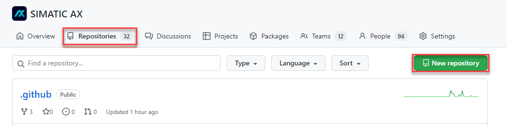
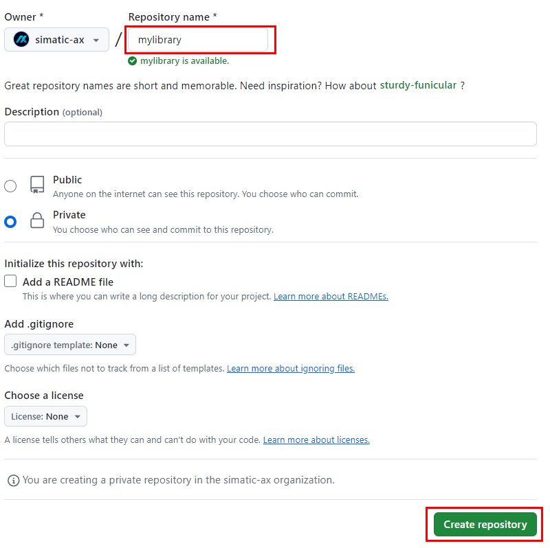
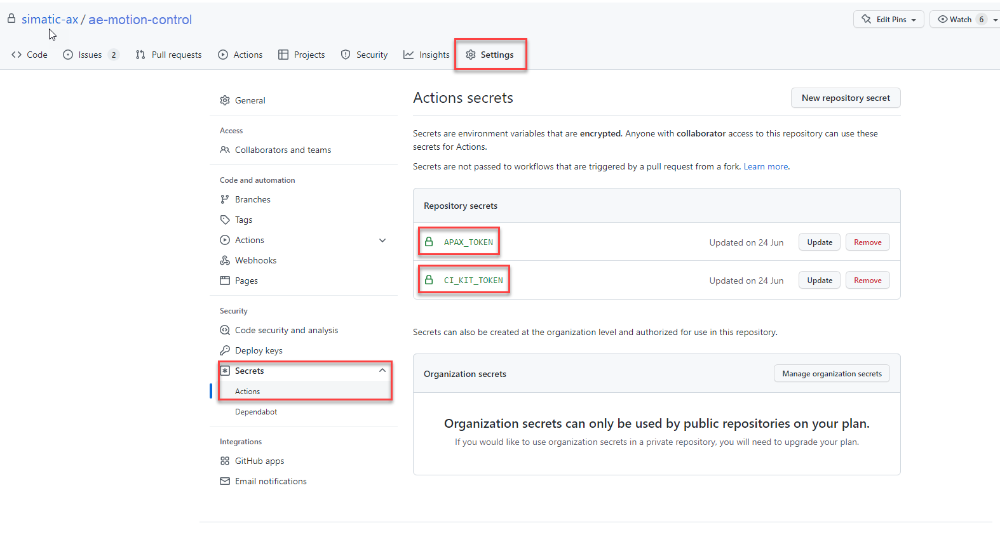
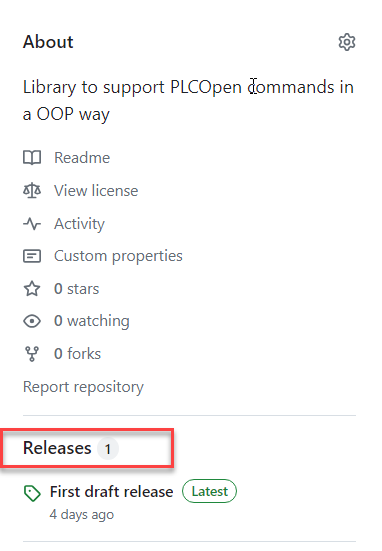
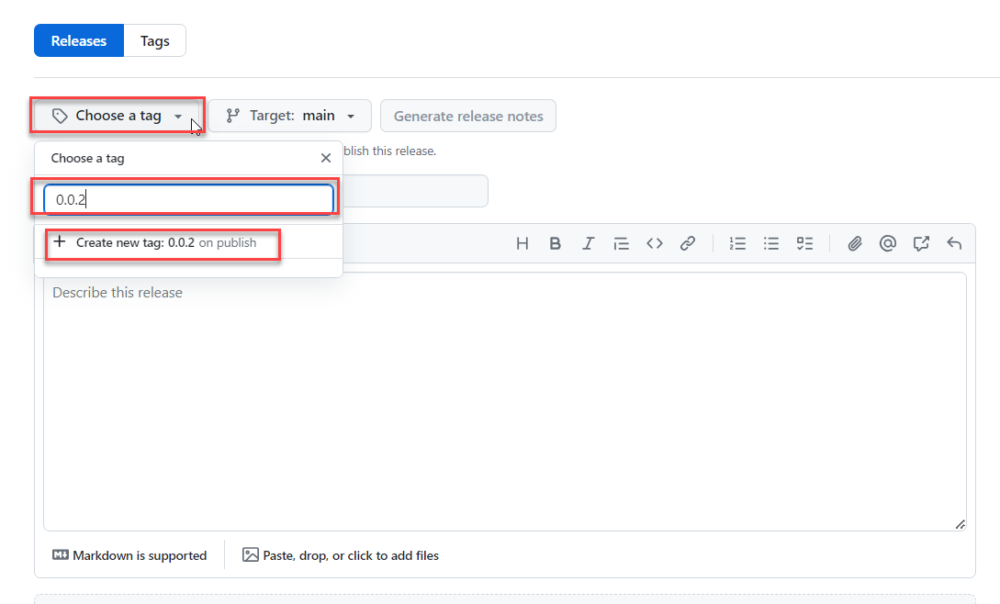

# Template for `Libraries` on GitHub

## What is an library

A library is a standalone project, which offers a collection of prewritten and tested code-elements that other users can reuse to optimize theire tasks. This template is tailored for the creation of libraries for PLC applications (executable on a PLCSIM Advanced or real PLC S7-1500).

## Create a project from this "apax-template"

If you want to create a new Github library in this community please start with using this apax-template by entering the following in the terminal :

```bash
apax create @simatic-ax/library --registry https://npm.pkg.github.com
```

## Folder-structure of this "library" apax-template

```bash
library
 |
 +- .github
 |   | # default GitHub workflows any gh-community-scope lib-repo should have (ignore)
 |   +- build-library.yml
 |   +- lint-repo.yml
 |   +- release-library.yml
 |
  +- snippets
 |   | # adjust and add user-defined vscode snippets
 |   +- namespacesupport.json
 |   +- usingNamespace.json
 |
 +- docs
 |   | # the place for additional user-documentation
 |   +- MyClass.md
 |
 +- src
 |   | # adjust and add library src files here
 |   +- myClass.st
 |
 +- test
 |   | # adjust and add test-programs here
 |   +- test.st
 |
 | # additional meta-information for GitHub/-workflows (ignore)
 +- .gitattributes
 +- .gitignore
 +- .markdownlint.yml
 | # adjust the project description file / add apax-scripts
 +- apax.yml
 | # settings file for activate of renovate
 +- renovate.json
 | # essential git project files, pls. adjust
 +- CODEOWNERS
 +- README.md
 +- LICENSE.md #do not change!
```

## Create a `library` repository with this apax-template on GitHub

Step-by-step instructions: for creating & releasing `mylibrary` (case example)

1. Create a repository `mylibrary` on GitHub

    This repository is tailored to be in sync with your local git-repository which holds on to your actual library program.

    Purpose: Later people can create local clones/ forks from the repository and all its files. This repository is also the storage place for the apax-package, which other apax/npm users can install. The creation of that package is described in an other chapter.

    

    

    - For the actual "Repository name" try to use a short name or a abbreviation.
    - As "Description" please start with `Library for ...`.
    - If "public" or "private" depends on internal decisions.

2. Add the secrets to the repository (only in the case if it's private)

    

   > You don't know the secrets? Ask one of the owners or `@sjuergen`

3. Initiate your local repository

   Once this is done the remote crepository on GitHub is ready to receive the library from your local Git repository.

   Therefore follow the steps below on your local system by navigating to your desired project directory for the library. Open the terminal.

4. If not done yet, login to the GitHub registry first

    ```bash
    apax login --registry https://npm.pkg.github.com/
    ```

    Follow the instruction and type in your credentials.

    More information you'll find [here](https://github.com/simatic-ax/.github/blob/main/docs/personalaccesstoken.md)

5. Create a new project based on the GitHub library apax-template

    After a successful login you can follow-up with entering:

    ```bash
    apax create @simatic-ax/library --registry https://npm.pkg.github.com mylibrary
    ```

    Here: the library will be named "mylibrary" and the project-folder now is predefined with the templates contents.

6. Connect the previous created remote GitHub repository to your local Git repository

    A apax "create" command will always initiate a local Git repository. This one must be synced  with the "simatic-ax/mylibrary" GitHub repository now.

    ```bash
    git remote add origin git@github.com:simatic-ax/mylibrary.git
    ```

    ```bash
    git push -u origin main
    ```

7. Install the project dependencies

      ```bash
      apax install
      ```

8. Optionally update its dependencies

      ```bash
      apax update
      ```

9. Now you can implement the library contents

    Open the project-folder with AX-Code and start adjusting the files to fit your library. Consider using Git branches and frequent commits in order to keep track of your changes.
    Don't forget to sync your local changes with the git-remote repository on GitHub at some point.

### Before releasing

Before you release the application example, all checks have to be done:

- [ ] OSS Clearing
- [ ] Patent Clearing
- [ ] ECC (Export control with the [ecc wizzard](https://code-ops.code.siemens.io/ecc-wizard/))
- [ ] License is up to date
- [ ] Codeowner are up to date
- [ ] The Readme.md contains a description:
  - What is this library doing ?
  - How to install the library
  - How to use the library
- [ ] Library has been reviewed
  - Create an MergeRequest for your Main-branch and add community-admins as reviewer

### Release of the library

Successfully releasing your library will trigger the creation of an apax-package of your current repository. Depending on the used workflows the repository may have to succeed linter and other checks in order to do so. Be aware of failing pipelines (GitHub workflows).

Draft a new "Release"-tag within your GitHub repository

- choose an appropriate version tag
- choose an appropriate release-title
- let github generate release-notes
- publish release





> This action may only can be performed by one of the community-admins.  

## Congratulations 🐱‍🏍

You finally contributed to the simatic-ax community offering apax-packages for everyone by simply using apax.

KEEP GOING 🐱‍💻!

> BE AWARE: Only successful GitHub workflows (pipelines) will create the package at our GitHub package-registry (scope:@simatic-ax).  

## Learn More

See the [documentation on custom templates](https://axciteme.siemens.com/docs/apax/templates).
