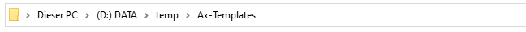
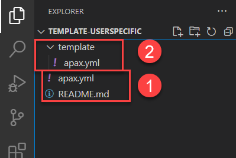
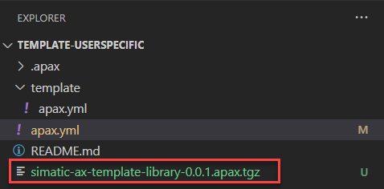

# Apax Template Package

## What is a template

See the [documentation on custom templates](https://axciteme.siemens.com/docs/apax/templates).

## How to use it

1. If not done, login to the GitHub registry

    More information you'll find [here](https://github.com/simatic-ax/.sharedstuff/blob/main/doc/personalaccesstoken.md)

1. Create a new library project from template from CLI

      ```sh
      apax create @simatic-ax/library --registry https://npm.pkg.github.com
      ```

      and follow the dialog

      alternatively you can enter the workspace name:

      ```sh
      apax create @simatic-ax/library --registry https://npm.pkg.github.com <Workspace Name>
      ```

## Create own templates on GitHub

If this template is not suitable for you, you can create your own user specific templates. This describes, how a template for GitHub is created. For other Git provider it might be similar, but each Git provider has its own specific properties.


### Setup template workspace

1. Select your target path. In this example, it is shown with the Windows Explorer

   

1. Open a console by entering `cmd + Enter` in the address text box

   

   Result: A command line window will be opened

1. Create a new, empty template workspace by entering:

   ```sh
   apax create template template-userspecific
   ```

   > **Important:** It's very important, that the name of the template package starts with `template-` followed by the name of the template (e.g. `template-userspecific`)

1. Open the template workspace with:

   ```sh
   axcode template-userspecific
   ```

   Result:
   AX Coder is opened and you an see the following workspace structure which consists of:

      

   1. The apax.yml `(1)` which is the description for the template package

   1. The apax.yml in the template folder `(2)` which belongs to the workspace, which will be created, when you create a workspace from tis template.

   > The template-folder `(2)` is the folder, which contains all files and folders for the workspace to be created from this template.
   > For example, it can contain:
   >
   > - your individual apax.yml with scrips, variables or common used dependencies
   > - src- and test-folder with example files
   > - a README.md
   > - a docs folder for further documentation

### Modify the apax.yml `(1)`

   The default apax.yml is not suitable to publish your package on a GitHub registry.

   Default apax.yml

   ```yml
   name: "template-userspecific"
   version: 0.0.0
   type: generic
   ```

   1. Scope of the template on GitHub

      For GitHub it's important, that the scope is part of the name section. On GitHub, the name of your [GitHub organization](https://docs.github.com/en/organizations/collaborating-with-groups-in-organizations/about-organizations) is also the scope.

      If your organization is `simatic-ax`, then the name section in the apax yml must look like:

      ```yml
      name: "@simatic-ax/template-userspecific"
      ```

   1. Define URL for the scope `@simatic-ax`

      Add the registries section to the apax.yml

      ```sh
      registries:
         '@simatic-ax': 'https://npm.pkg.github.com/'
      ```

   1. Define the content for the template

      In the file section, in the apax.yml, you can define, what generally will be shipped in a package. For templates, at minimum, the template folder must be shipped. This can be done, by adding the following lines to tha apax.yml

      ```yml
      files:
      - 'template'
      ```

   1. Final apax.yml

      ```yml
      name: '@simatic-ax/template-library'
      version: 0.0.0
      type: lib
      author: Siemens AG
      registries:
        '@simatic-ax': 'https://npm.pkg.github.com/'
      files:
        - 'template'
      ```

      > In this example, you a template for a library (type: lib) will be crated. A list of valid types, you can find here: [valid types](https://console.prod.ax.siemens.cloud/docs/apax/yml#type)
      >
      > The author field is optionally

   1. Learn More abut the apax.yml

      [Manifest (apax.yml) Reference](https://console.prod.ax.siemens.cloud/docs/apax/yml)

### Prepare GitHub for your template package

   1. Go to your organization on GitHub

   1. Create a new repository

      

   1. Enter exactly the name of your template in the field `Repository name`. In this example it is `template-library` and click on `Create repository`

      

   1. Add the remote repository on GitHub to your local repository (optionally)

      ```sh
      git add *
      git commit -m "first commit"
      git branch -M main
      git remote add origin git@github.com:simatic-ax/template-library.git
      git push -u origin main
      ```

      Result: now your template is also available on GitHub 

### Create the template package

   Since the repository `template-library` is available on GitHub, you can continue publishing your package on the GitHub registry.

   1. Create the package version

      ```
      apax version 0.0.1
      ````

      Result in apax.yml

      ```yml
      version: 0.0.1
      ```

   1. Create the template package

      ```
      apax pack
      ```

      Result: The package file `simatic-ax-template-library-0.0.1.apax.tgz` has been created

      

   1. Publish the package on your GitHub registry

      **Important:** If not logged in on GitHub, you've to do it before you can publish a package. More information you'll find [here](https://github.com/simatic-ax/.sharedstuff/blob/main/doc/personalaccesstoken.md)

      ```
      apax publish --registry https://npm.pkg.github.com --package simatic-ax-template-library-0.0.1.apax.tgz
      ```

      alternatively you can add a script `publishlib` to the apax.yml

      ```yml
      name: '@simatic-ax/template-library'
      version: 0.0.1
      type: lib
      author: Siemens AG
      registries:
      '@simatic-ax': 'https://npm.pkg.github.com/'
      files:
      - 'template'
      scripts:
      publishlib:
         apax publish --registry https://npm.pkg.github.com --package *.apax.tgz
      ```

      and call the script with

      ```sh
      apax publishlib
      ```

      The template is published and ready to use

### Create a workspace from your template

1. Go to the folder, where your workspace should be created and open a command line interface (or navigate via command line interface to your destination folder)

1. Enter the command

   ```sh
   apax create @simatic-ax/library --registry https://npm.pkg.github.com
   ```

   >Note: the when you create a workspace from a template, the prefix `template-` must not be used.

## Learn More

See the [documentation on custom templates](https://axciteme.siemens.com/docs/apax/templates).
